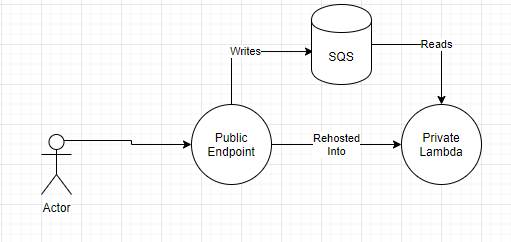

# NateTorious.DurableTaskFactory

When services invoke `Task.Run` there are many scenarios where the message becomes lost, e.g. host reboot.

This lightweight wrapper allows lifting those callbacks into more durable systems with serverless technologies like Amazon Simple Queuing Services (SQS) and Lambda.

## How do I upgrade my existing service

While refactoring is tedious and time consuming often its easier to rehost existing technologies.

1. Create an Amazon SQS Queue
2. Create an Amazon Lambda and reference existing service binaries
3. Create an Event Source from the Queue to Lambda
4. Replace `Task.Run` with `DurableTaskFactory.CreateTaskAsync`
5. Enjoy the magic of reflection =)

